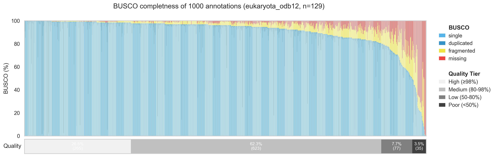

# BUSCO-tracker

Automated BUSCO analysis for eukaryotic genome annotations. 
See all results [here](BUSCO/eukaryota_odb12/BUSCO.tsv).

## Status

**Last updated:** 2026-07-17T12:26:32Z

| Metric | Count | Percentage |
|--------|-------|------------|
| **Total annotations** | 16373 | 100% |
| **Has BUSCO values** | 15366 | 93.8% |
| **Pending/Retry** | 67 | 0.4% |
| **Given up** | 940 | 5.7% |


*Busco values for 1k randomly sampled annotations. Completness is based on eukaryotic BUSCO genes (129). Quality value thresholds are arbitrary*


Find all annotations on [annotrieve](https://genome.crg.es/annotrieve/) and and interact with them using [annocli](https://github.com/apollo994/annocli) 


```
annocli summary --annotation-ids 10cc9bb02de0e989a4710ed0a162be4c
```
